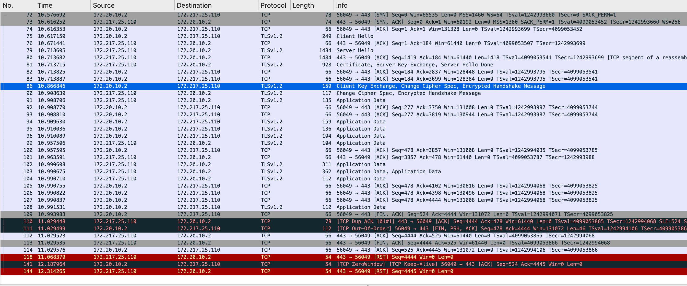

# httptrace-client

httptrace sample in golang

```
$ go run main.go

2019/08/17 18:37:54.178798 GetConn: google.com:443
2019/08/17 18:37:54.179219 DNSStart: {Host:google.com}
2019/08/17 18:37:54.181677 DNSDone: {Addrs:[{IP:216.58.196.238 Zone:} {IP:2404:6800:400a:806::200e Zone:}] Err:<nil> Coalesced:false}
2019/08/17 18:37:54.288372 TLSHandshakeStart
2019/08/17 18:37:54.942141 TLSHandshakeDone: {Version:771 HandshakeComplete:true DidResume:false CipherSuite:49195 NegotiatedProtocol:h2 NegotiatedProtocolIsMutual:true ServerName: PeerCertificates:[0xc000088b00 0xc000089080] VerifiedChains:[[0xc000088b00 0xc000089080 0xc0002adb80]] SignedCertificateTimestamps:[[0 164 185 ...]}
2019/08/17 18:37:54.942706 GotConn: {Conn:0xc000098a80 Reused:false WasIdle:false IdleTime:0s}
2019/08/17 18:37:54.942855 WroteHeaderField: :authority [google.com]
2019/08/17 18:37:54.942865 WroteHeaderField: :method [GET]
2019/08/17 18:37:54.942870 WroteHeaderField: :path [/]
2019/08/17 18:37:54.942876 WroteHeaderField: :scheme [https]
2019/08/17 18:37:54.942886 WroteHeaderField: accept-encoding [gzip]
2019/08/17 18:37:54.942892 WroteHeaderField: user-agent [Go-http-client/2.0]
2019/08/17 18:37:54.942956 WroteRequest: {Err:<nil>}
2019/08/17 18:37:55.170277 GotFirstResponseByte
```

You'll know that https request is performed as follows:

1. create connection
1. dns resolve, get ip
1. TLS handshake start
1. get connection
1. write http header
1. finish writing http header
1. recieve response

Here is a capture of tcp packets.

From client ip (172.20.10.2) to server ip (172.217.25.110), packet sent on TLSv1.2.



